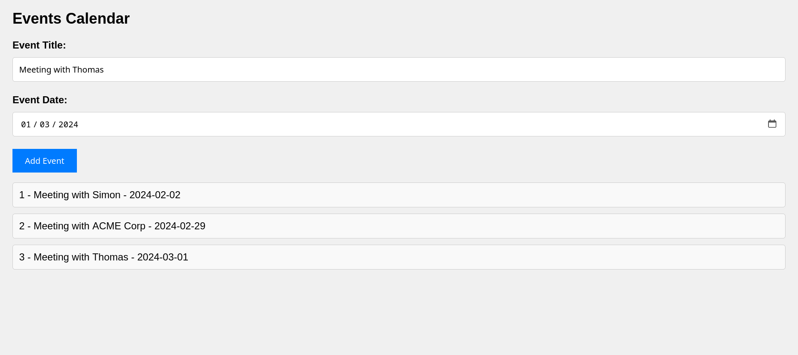

# FastAPI, SQLite and HTMX example

This is my first practice project with FastAPI.
So far I made a simple form that writes to a sqlite database using SQLAlchemy and shows all entries  by polling the events route.



## TODO:
- Authentication
- Datavalidation and avoiding XSS 
- Sorting by Event Date
- Error handling
- Unit Tests for backend and frontend
- Internationalization


## How to run
```
pipenv install
uvicorn main:app --reload
```